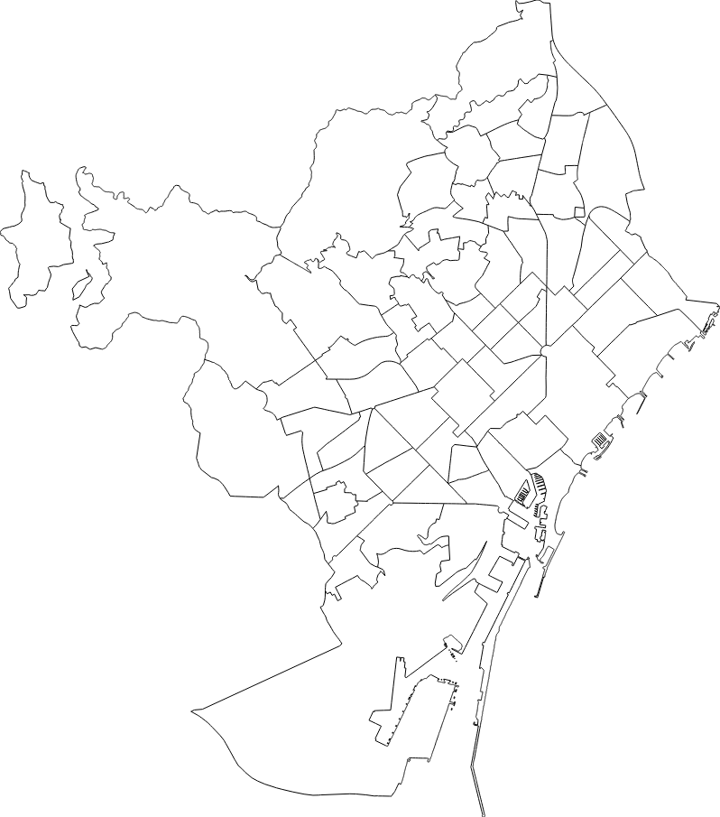

# :es: :european_castle: Barcelona àrees bàsiques de salut



This repository contains an example of the actual map of Barcelona, divided by
the health areas of the city (ABS).

You can find the original `shapefile` [here](http://salutweb.gencat.cat/ca/el_departament/estadistiques_sanitaries/cartografia/).

Alternatively, you can just point to this gist, that will return the same data
in a `topojson` [here](https://gist.githubusercontent.com/glippi/86b8ce8b6db37ab6cacea573440df1b8/raw/45ecc0e8428fb672a133c0af48cd0102a72bb47b/FINAL).

## Code example
```
<!DOCTYPE HTML>
<html lang="en">
  <head>
      <meta charset="UTF-8">
      <title>Barcelona àrees bàsiques de salut</title>
  </head>

  <body>
    <svg id="abs" width="100%" height="1000"></svg>

    <script src="https://d3js.org/d3.v5.min.js"></script>
    <script src="https://d3js.org/topojson.v3.min.js"></script>
    <script>
      const URL_ABS = "https://gist.githubusercontent.com/glippi/86b8ce8b6db37ab6cacea573440df1b8/raw/45ecc0e8428fb672a133c0af48cd0102a72bb47b/FINAL"


      const svg = d3.select("#abs");
      const path = d3.geoPath();

      d3
        .json(URL_ABS)
        .then(barcelona => {
          const abs = barcelona.objects["ABS_2018"].geometries;

          svg
            .append('path')
            .attr('d', path(topojson.mesh(barcelona)))
            .attr('fill', 'none')
            .attr('stroke', 'black');
        })
        .catch(err => console.warn(err));
    </script>
  </body>
</html>
```


## General info about how to plot a map
If you are interested in know more about cartography and how to plot a topojson
representation of a geography using `D3`, you definetely should read this
blogposts series by ([Mike Bostock](https://github.com/mbostock)) (a.k.a. the creator of D3) [here](https://medium.com/@mbostock/command-line-cartography-part-1-897aa8f8ca2c).
